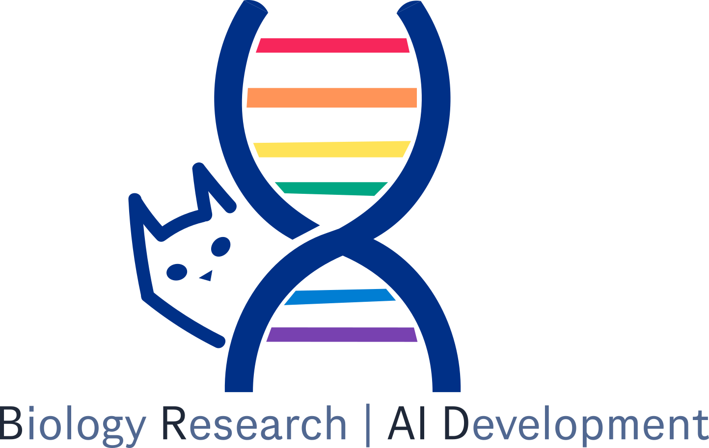

  

# Welcome to the BRAID website

**BRAID** is a department within Genentech dedicated to advancing biological and clinical sciences through artificial intelligence. Our core focus is on developing foundation models—general-purpose AI models trained on large-scale biological datasets—which we fine-tune for specialized applications.

At BRAID, we not only develop cutting-edge AI tools but also actively use them to advance scientific discovery. All of the tools we make available to the scientific community are linked on this page. We always welcome feedback—feel free to contact [Tommaso](mailto:biancalt@gene.com) or the [BRAID leadership team](https://www.gene.com/scientists/our-scientists/braid) with any input or suggestions.

# Our Software

## Foundation Models for Transcriptomics

[**SCimilarity**](https://github.com/Genentech/scimilarity) : Unifying representation of single cell expression profiles

[**PaSCient**](https://github.com/genentech/pascient): Multi-cellular representations of single-cell transcriptomics data

## DNA/RNA Sequence2Function  

[**gReLU**](https://github.com/Genentech/gReLU): Train, interpret, and apply deep learning models to DNA sequences

[**Decima**](https://github.com/Genentech/decima): DNA sequence models on single-cell RNA-seq data

[**Polygraph**](https://github.com/Genentech/polygraph): Evaluation and comaprison of nucleic acid sequences for regulatory element design

[**regLM**](https://github.com/Genentech/regLM): hyenaDNA-based autoregressive language models on DNA for generation of novel regulatory elements

[**ARGMINN**](https://github.com/Genentech/ARGMINN): Mechanistically interpretable neural network for regulatory genomics

## Virtual Screens / Drug discovery

[**GNEprop**](https://github.com/Genentech/gneprop): Small molecule property predictor which we used for antibiotic discovery 

[**MolCap-Arena**](https://github.com/Genentech/molcap-arena): Benchmark on language-enhanced molecular property prediction

## Foundational Machine Learning

[**VCI**](https://github.com/yulun-rayn/variational-causal-inference): Estimating individual counterfactual treatment effects

[**BwR**](https://github.com/Genentech/bandwidth-graph-generation): Efficient and expressive graph generative modeling

[**GraphGUIDE**](https://github.com/Genentech/GraphGUIDE): Interpretable and controllable conditional graph generation

[**SPICE**](https://github.com/ndiamant/spice): Uncertainty estimation via conformal prediction for deep learning models

[**CTRL**](https://github.com/zhaoyl18/CTRL): RL-based conditional control for diffusion models

## Others / Tools

[**CellArr**](https://github.com/CellArr/cellarr): TileDB-backed store for large collections of genomic experimental data

## Prior software from current BRAID team members

[**Tangram**](https://github.com/broadinstitute/Tangram): Spatial alignment of single cell and spatial transcriptomics

[**MiloDE**](https://github.com/MarioniLab/miloDE): Sensitive DE testing using cell neighborhoods

[**Cumulus**](https://github.com/lilab-bcb/cumulus): A series of Cloud-based scalable and efficient single-cell genomics data analysis workflows

[**Pegasus**](https://github.com/lilab-bcb/pegasus): A scalable and efficient tool for analyzing transcriptomes of millions of single cells

[**Cirrocumulus**](https://github.com/lilab-bcb/cirrocumulus): An interactive visualization tool for large-scale single-cell genomics data

[**Harmony-PyTorch**](https://github.com/lilab-bcb/harmony-pytorch): An efficient PyTorch implementation of Harmony algorithm, used for data integration and batch correction

[**NMF-Torch**](https://github.com/lilab-bcb/nmf-torch): An efficient PyTorch implementation of Non-negative Matrix Factorization (NMF) and integrative NMF (iNMF) algorithms, used for gene program analysis and batch correction

